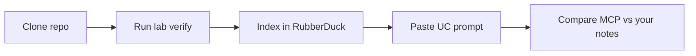

# Rubber Duck Playground — Complete Guide

Welcome to **Rubber Duck Playground**, the hands-on companion to [RubberDuck](https://rubberduck.com). This guide explains what the repository contains, how to run each lab, and how to pair local exercises with RubberDuck MCP in your IDE.

---

## Table of contents

1. [Why this exists](#why-this-exists)
2. [What you need](#what-you-need)
3. [Five-minute first run](#five-minute-first-run)
4. [How a lab session works](#how-a-lab-session-works)
5. [All ten use cases](#all-ten-use-cases)
6. [Branches and tutorials](#branches-and-tutorials)
7. [RubberDuck MCP setup](#rubberduck-mcp-setup)
8. [Tips for demos and teams](#tips-for-demos-and-teams)
9. [Troubleshooting](#troubleshooting)

---

## Why this exists

RubberDuck shines when it has **real code** to analyze. Reading docs alone does not build muscle memory. This playground gives you:

- A **single demo application** (`demoapp/`) with intentional bugs, security issues, and extension points
- **Ten isolated labs** mapped to the official RubberDuck workflows
- **Verify scripts** so you know the lab environment is healthy before opening MCP
- **Ready-made prompts** in `docs/` — the same language as the product documentation

The goal is simple: **run something locally, then ask RubberDuck to do the same job and compare.**



---

## What you need

| Requirement | Notes |
|-------------|--------|
| **Python 3.10+** | Labs use FastAPI, pytest, httpx |
| **Git** | Branch per use case for focused tutorials |
| **RubberDuck account** | Free tier works for indexing this repo |
| **Cursor, Claude Code, or Codex** | Any MCP-capable AI assistant |

Optional: a GitHub token if you index via remote URL instead of a local path.

---

## Five-minute first run

We recommend **UC 02 (Codebase Audit)** for a first impression — it includes a live API.

### 1. Clone the official repository

```bash
git clone https://github.com/RubberDuck-com/rubberduck-use-case-playground.git
cd rubberduck-use-case-playground
```

### 2. Run the lab launcher

```bash
python scripts/run-lab.py --uc 02 --verify
```

On Windows you can use:

```powershell
.\scripts\setup.ps1 -Uc 02 -Verify
```

The script will:

1. Create `.venv` and install dependencies (only on first run)
2. Execute the UC 02 verify script
3. Print an **index command** for RubberDuck
4. Print the **UC 02 prompt** from `docs/uc-02.md`

### 3. Start the API (optional but recommended)

```bash
python scripts/run-lab.py --uc 02 --start-server
```

Visit [http://127.0.0.1:8080/docs](http://127.0.0.1:8080/docs). The server exposes endpoints tied to deliberate security patterns in `demoapp/config.py` and `demoapp/api/server.py`.

### 4. Index and prompt

In Cursor chat, paste the index line from the launcher output, for example:

```
Index my GitHub repo: https://github.com/RubberDuck-com/rubberduck-use-case-playground
```

Then paste the security audit prompt from the launcher (or from `docs/uc-02.md`).

### 5. Compare

Note what you found manually (dangerous sinks, entry points, data flow). Check whether RubberDuck reports the same file and line evidence. That comparison is the training loop.

---

## How a lab session works

Every use case follows the same rhythm:

| Step | Action |
|------|--------|
| **Pick** | Choose UC 01–10 (`python scripts/run-lab.py --uc NN`) |
| **Verify** | Add `--verify` to confirm fixtures and tests are wired |
| **Explore** | Read the lab README under `labs/` for that UC |
| **Run** | Start servers or pytest as documented |
| **Index** | Load this repo into RubberDuck (GitHub URL or local path) |
| **Prompt** | Use the matching file in `docs/uc-NN.md` |
| **Reflect** | Did MCP find what you found? What did it miss? Why? |

Machine-readable metadata for automation lives in `labs/manifest.json`.

---

## All ten use cases

### UC 01 — Understand Your Code

**Skill:** Map how the application starts and where control flows.

- **Lab folder:** `labs/uc01_understand`
- **Focus files:** `demoapp/cmd/build.py`, `demoapp/application.py`
- **Runnable:** verify script traces entry points
- **Branch:** `uc-01-understand-your-code`

---

### UC 02 — Codebase Audit

**Skill:** Security-sensitive path analysis from HTTP handlers to sinks.

- **Lab folder:** `labs/uc02_security_lab`
- **Focus files:** `demoapp/config.py`, `demoapp/api/server.py`
- **Runnable:** FastAPI on port 8080
- **Branch:** `uc-02-codebase-audit`

Look for `eval`, pickle loads, and unvalidated input paths.

---

### UC 03 — Localize and Fix Bugs

**Skill:** Use tests and static reasoning to fix ORM logic bugs.

- **Lab folder:** `labs/uc03_buggy_orm`
- **Focus files:** `demoapp/db/query.py`
- **Runnable:** `pytest` in the lab folder
- **Branch:** `uc-03-localize-and-fix-bugs`

---

### UC 04 — Code Review

**Skill:** Structured approve/block decision on a realistic diff.

- **Lab folder:** `labs/uc04_pr_review`
- **Fixture:** `fixtures/uc-04-pr-order-by-diff.md`
- **Branch:** `uc-04-code-review`

---

### UC 05 — Change Impact Analysis

**Skill:** Blast radius before renaming a shared symbol.

- **Lab folder:** `labs/uc05_impact`
- **Scenario:** renaming `config_values` across consumers
- **Branch:** `uc-05-change-impact-analysis`

---

### UC 06 — Plan a New Feature

**Skill:** Turn failing tests into an implementation plan.

- **Lab folder:** `labs/uc06_feature`
- **Task:** `--parallel-write` for HTML builder
- **Note:** tests fail until you implement the feature (by design)
- **Branch:** `uc-06-plan-new-feature`

---

### UC 07 — Generate Code That Fits

**Skill:** Implement new code that matches project conventions.

- **Lab folder:** `labs/uc07_codegen`
- **Task:** complete `demoapp/ext/gitlab.py` role handling
- **Note:** tests fail until implementation is done
- **Branch:** `uc-07-generate-code`

---

### UC 08 — Check Code Logic

**Skill:** Review business logic for edge cases and staleness rules.

- **Lab folder:** `labs/uc08_logic`
- **Focus:** `get_outdated_docs` in `demoapp/builders/html.py`
- **Branch:** `uc-08-check-code-logic`

---

### UC 09 — Compare Versions

**Skill:** Structural comparison between two implementations.

- **Lab folder:** `labs/uc09_compare`
- **Compare:** HTML builder vs Epub3 builder
- **Branch:** `uc-09-compare-versions`

---

### UC 10 — Quick Check

**Skill:** Fast, scoped assessment of one function.

- **Lab folder:** `labs/uc10_quick`
- **Focus:** `render_partial` in the HTML builder
- **Branch:** `uc-10-quick-check`

---

## Branches and tutorials

`main` contains **all labs together** — best for development and CI.

Each `uc-NN-*` branch adds a focused **TUTORIAL.md** for that workflow only:

```bash
git checkout uc-07-generate-code
cat TUTORIAL.md
```

Use branches when onboarding someone on a single workflow. Use `main` when you want the full playground in one checkout.

---

## RubberDuck MCP setup

Full connection details: **[SETUP.md](SETUP.md)**.

Short version:

1. Get your API token from [rubberduck.com](https://rubberduck.com)
2. Add Codebase Intelligence and Semantic Intelligence to your MCP config
3. Restart the IDE
4. Health check: ask the assistant to confirm both servers respond
5. Index this repository (GitHub URL or local path)

**Recommended index line for teams:**

```
Index my GitHub repo: https://github.com/RubberDuck-com/rubberduck-use-case-playground
```

Prompts for each UC live in `docs/uc-01.md` through `docs/uc-10.md`.

---

## Tips for demos and teams

### Standup-friendly demo (90 seconds)

1. `python scripts/run-lab.py --uc 02 --verify`
2. Show the printed prompt
3. Index the repo in Cursor
4. Paste prompt — highlight file:line evidence in the response

### Weekly learning path

| Week | Use cases |
|------|-----------|
| 1 | UC 01, UC 02 |
| 2 | UC 03, UC 04 |
| 3 | UC 05, UC 06 |
| 4 | UC 07, UC 08 |
| 5 | UC 09, UC 10 |

### Larger real-world repos

Some official tutorials reference upstream projects (Sphinx, Django, etc.). See `docs/recommended-repos.md` when you graduate from the playground.

---

## Troubleshooting

| Problem | Fix |
|---------|-----|
| `python` not found | Use `py -3` on Windows or install Python 3.10+ |
| Verify fails on UC 02 | Ensure port 8080 is free before starting the server |
| MCP tools missing | Restart IDE after editing MCP config; see SETUP.md |
| Tests fail on UC 06 / 07 | Expected until you complete the coding task |
| Wrong repo indexed | Re-index using the RubberDuck-com URL above |

---

## Where to go next

- Product docs: [rubberduck.com/#docs](https://rubberduck.com/#docs)
- MCP wiring: [SETUP.md](SETUP.md)
- Lab metadata: [labs/manifest.json](labs/manifest.json)

Happy learning — and may your rubber duck always point at the right line number.
